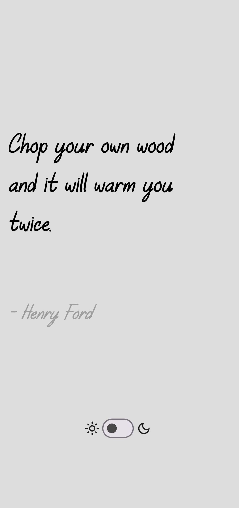
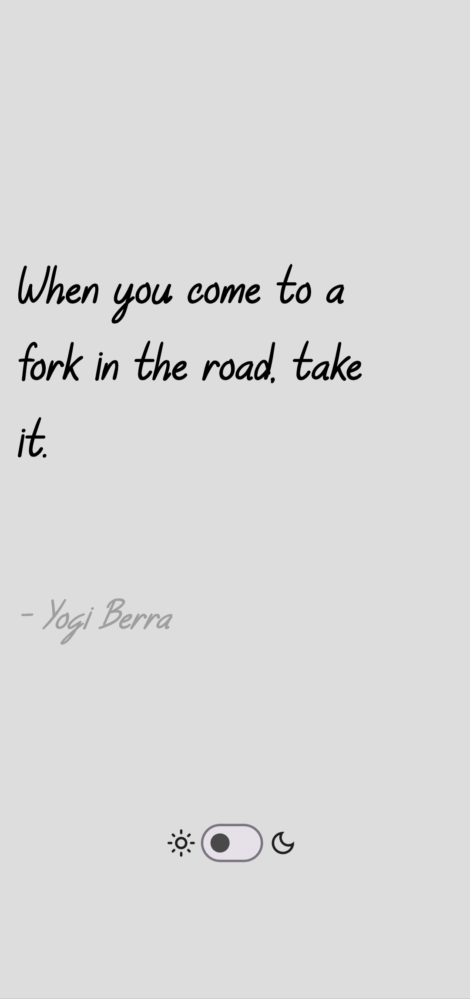
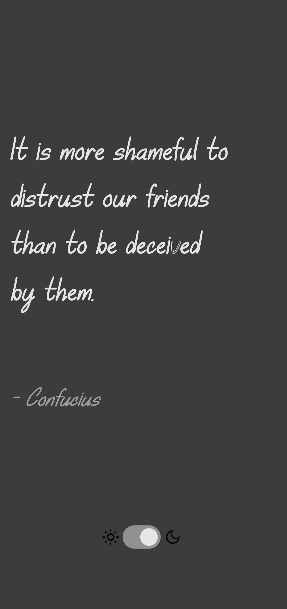
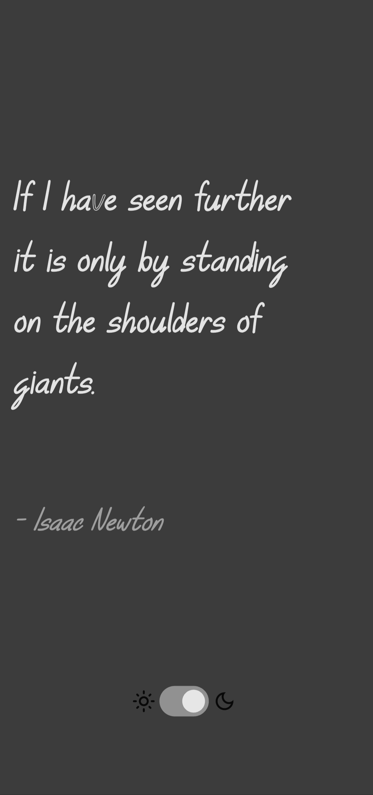

# ZenQuote — Minimal Flutter Quotes App

A clean and minimal **Flutter** app that displays **random inspirational quotes** with the author name.  
Swipe left or right to discover a new quote, anytime.

---

## ✨ Features

- 🎲 Random quote on every swipe  
- 👤 Displays quote author  
- 🌗 Day & Night mode (Light / Dark theme)  
- 🎨 Minimal and distraction-free UI  
- ⚡ Smooth swipe animations  

---

## 📱 Screenshots

<!-- Add your screenshots inside a folder named /screenshots and update file names below -->

<p align="center">
  
  
  
  
</p>

---

## 🚀 Getting Started

```bash
git clone https://github.com/your-username/your-repo-name.git
cd your-repo-name
flutter pub get
flutter run